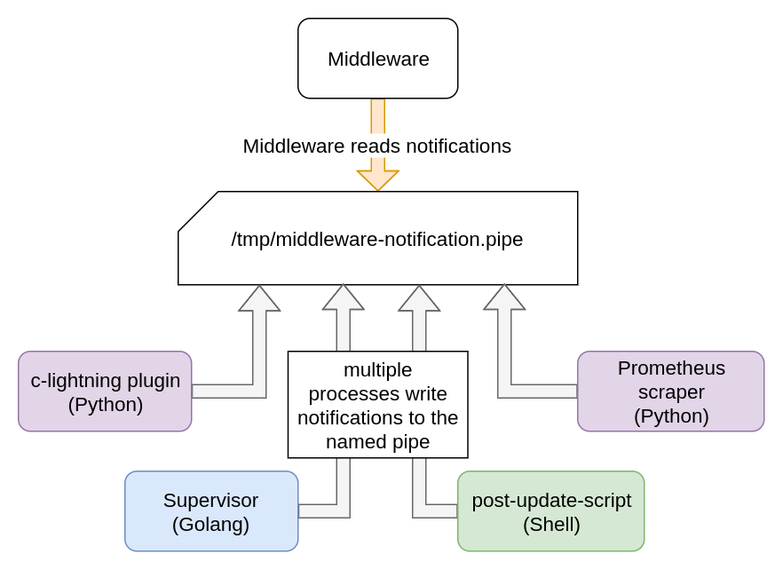

## Middleware: Communication


### BitBoxApp <-> Middleware RPCs

TODO

The Middleware handles the communication between the BitBoxApp and the BitBoxBase.

- minimize traffic
- RPC Client/Server (Go RPC package)
- Why Websockets
- End to End encryption
- Noise paring / handshake
- TLS vs Noise
- JWT Authentication

Specific RPC sequence diagrams:

* [Streaming ServiceInfo changes to App frontend](base-streaming-service-info-changes-to-frontend_sequencediagram-org.svg){:target="_blank"}


### HSM communication

TODO

### IPC notifications

The Middleware is able to receive IPC notifications from other processes running on the BitBoxBase.
IPC notifications are implemented via a Unix named pipe and notifications are formatted in a JSON based protocol.
Using a named pipe allows simple and dependencyless implementation in other Go, Python or Shell Script based processes running on the BitBoxBase.
One draw back is that a named pipe blocks writes until the content is read.
By default the named pipe is located in `/tmp/middleware-notification.pipe` and system level permissions are required to write in the pipe.



*Schematic showing multiple scripts writing notifications into the named pipe.*

The JSON based protocol for the notifications is versioned, includes a notification topic and a can contain a  payload.
The payload can contain any valid JSON structure.
Since a write operation to a unix pipe only being atomic (i.e. two writes do not interleave) as long as the amount written is smaller than the `PIPE_BUF`, which is 4096 bytes for Linux, the Middleware drops all notifications bigger than 4095 bytes.

*Sample notification:*
```JSON
{"version": 1, "topic": "sampletopic", "payload": {"sampleInt":123,"sampleString": "string", "sampleBool": true}}
```
