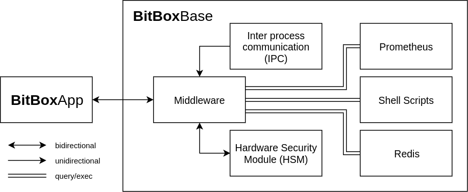

## Middleware: Functionality

The Middleware connects the BitBoxBase system with the BitBoxBase user interfaces, such as the BitBoxApp and the HSM screen.
The task of the Middleware is to respond to synchronous user request and to asynchronously notify the user about changes on the system.
A action from the user could for example toggle _SSH access_ or requests for information about the Bitcoin blockchain synchronization progress.
A notification from the Middleware to the user could be for example about an available software update or the disk running out of space.

### Tasks of the Middleware

The Middleware processes Remote Procedure Calls (RPCs) from the BitBoxApp, keeps a connection to the HSM, queries both Redis and Prometheus servers, executes shell scripts to change system configuration and listens on an inter process communication (IPC) interface for notifications from other processes.

 

*Schematic showing the Middleware and it's connections.*
 
 

#### App connectivity via RPC
The BitBoxApp acts as RPC Client talking to the Middleware's RPC Server.
Available RPCs can for example change system configuration, set the user password, create or restore a backup, update the BitBoxBase software or deliver information on services such as Bitcoin Core or c-lightning running on the Base.
The [BitBoxApp <-> Middleware communication section](middleware-communication.html) includes more detail on design and implementation decisions.

#### HSM connectivity via UART

The Middleware communicates with the HSM over UART.
Messages are serialized as Protobuf messages.

#### Querying Redis and Prometheus

The Redis server on the BitBoxBase acts as a store for system configuration and the Prometheus server holds service specific information.
The Middleware queries information from both.

#### Executing shell scripts

The Middleware calls the [bbb-cmd.sh](../bbb-cmd.html) and [bbb-config.sh](../bbb-config.html) scripts to change system configuration and to call standard commands.

#### Listening for IPC notifications

Processes running on the BitBoxBase can notify the Middleware about changes the user needs to be made aware of.
This is for example used to notify the Middleware about a successful completion of system checks after an update.
The [communication section](middleware-communication.html) includes detailed information about the IPC implementation.
