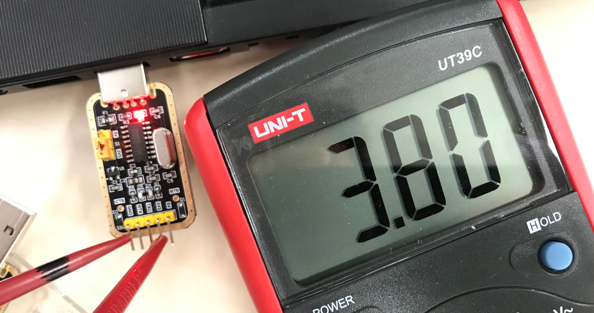
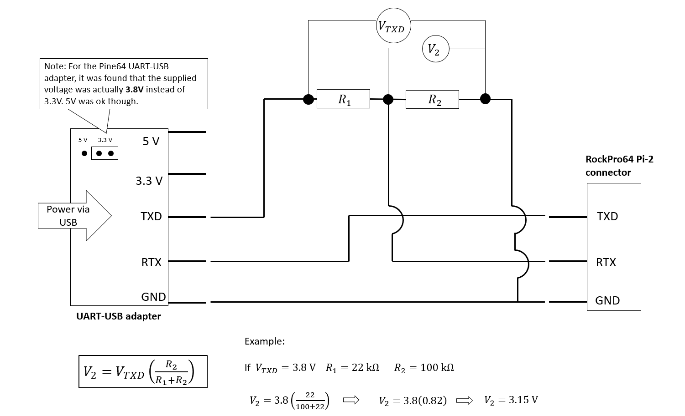

## UART communication

The integrated BitBox will be powered and communicate with the RockPro64 using the UART pins on the Pi-2 connector.
The pin numbers on Pi-2 connector are 4,6,8,10 (5V, Ground, UART_TXD and UART_RXD respectively).

### UART communication issue and solution

Initially when testing the UART communication with the Pine64 USB-UART adapter, it was found that connecting the UART_TX pin on the USB-UART adapter to the UART_RXD pin on the Pi-2 connector (pin 10) resulted in the board freezing and unable to boot properly.
It was later discovered that the Pine64 USB-UART adapter was outputting 3.8V instead of 3.3V (figure 1), and the Pi-2 connector on the RockPro64 uses 3.0V.
This resulted in too much voltage being delivered to the Pi-2 connector.
Using some resistors, it was possible to decrease the TX voltage to 3.1V.
This resolved the problem and bilateral communication through the UART interface was possible.
See figure 2 below for more information on how the voltage was reduced.

*Figure 1: Voltage reading of stock Pine64 UART-USB adapter*

*Figure 2: Schematic of voltage decrease for Pine64 UART-USB adapter*
