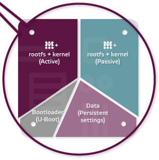
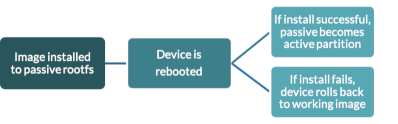

## Base image upgrades

For any modern device with evolving features, especially in a security-critical environment, regular updates are an absolute must.
Providing new features, improvements and timely security-patches is a key focus of our project.

In terms of upgrading a system, there are several approaches:

* **script-based, no modularization**: upgrading the system with scripts, without modularization of individual components, is a lost cause as differences and issues accumulate over time.

* **modular updates**: a more reliable approach is to encapsulate components in individual modules, e.g. using Docker. Every module can be updated to a defined state. Issues can arise when different versions of modules are not working well together, or when the base operating system needs updating.

* **disk image update**: updates overwrite the whole disk partition, usually containing the operating system and applications. This results in a very reliable, cleanly defined state. The whole system can be tested in-depth beforehand, but this low-level method adds complexity to the upgrade process.

### Our approach: atomic disk image updates

We are working towards the goal to build the BitBoxBase as an appliance with 'firmware', not as a small Linux server.
This is why we decided to implement a full disk image update process, using the [Mender](https://mender.io/) open-source solution.

This solution has the following features:

* **enterprise-grade**: despite being open-source and free to use, Mender is a professional solution with its own Deployment Management server and a robust client update daemon.
* **full disk image**: the whole operating system including all applications are updated together, resulting in a clearly defined state of the system.
* **atomic**: the update process is atomic, as it either succeeds in full (including custom application tests), or not at all. In case of failure, a full rollback is performed.
* **on-demand**: the BitBox App will prompt you when an update is available, but you're not forced to upgrade.
* **secure**: all upgrades are provided over a secure TLS communication connection and are cryptographically signed by Shift Cryptosecurity. By default, no unsigned updates are accepted by the device.
* **efficient**: update images are compressed and are streamed directly to the device. As of today, a full update (operating system and all applications) is ~300 MB in size.
* **minimal downtime**: the update is performed in the background, while applications continue to run. Only a single reboot is necessary to start the updated configuration.
* **persistent data**: the eMMC contains multiple partitions, one of which is used to store persistent data like the device configuration.
* **custom Base image**: more in the #reckless category, updating custom-built Base image can be enabled through the BitBox App.

### Upgrade process

After building the custom Armbian image, it is post-processed using [mender-convert](https://github.com/mendersoftware/mender-convert).
We collaborated with Mender to extend their solution to support the RockPro64 board, with all extension being released as open-source for other projects to use.

This post-processing creates Mender upgrade artifacts for over-the-air (OTA) updates, as well as a new full disk image for initial flashing on the device, containing four partitions:

* bootloader
* root filesystem A
* root filesystem B
* persistent data

The disk image has the Mender client built in. It is executed on demand by the Middleware to update the device.

On the BitBoxBase, only one root filesystem - running the operating system and applications - is active at any given time, e.g. "root filesystem A".
When the update process is started, the new disk image is streamed directly to the non-active root filesystem, e.g. "root filesystem B".
After successful verification of the update signature and completion of the download, the bootloader is configured to boot from the updated "root filesystem B" once.
The device is then rebooted.

The BitBoxBase now boots into the updated "root filesystem B", where various custom checks can be performed.
If everything works as expected, the updated "root filesystem B" is commited to the bootloader as the new active partition.

If the device is unable to boot, or if application-level checks fail after the update, the system automatically falls back to booting to the previous "root filesystem A", which was working before the upgrade.
This process makes it very unlikely that a device will end up in a state that can't be fixed using further OTA upgrades.

See additional information on <https://mender.io/overview/solution>
Images (c) 2019 by [Northern.tech AS](https://northern.tech/)
