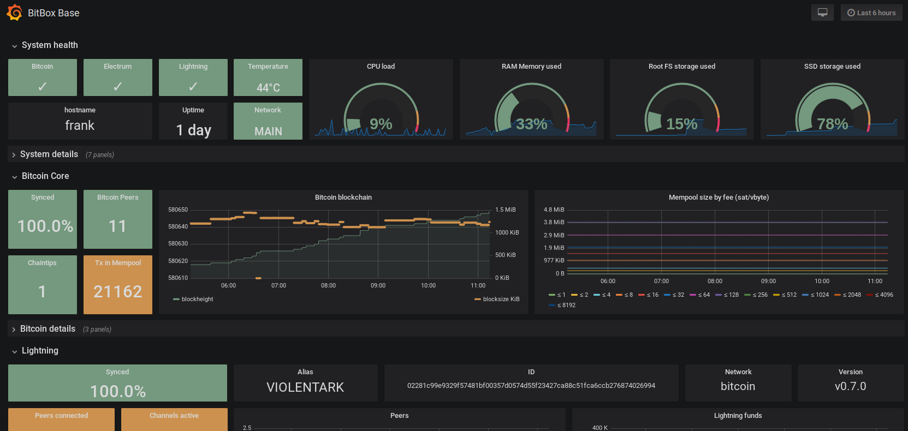

## Grafana: Performance Visualization

The BitBox Base is a headless device that does not provide a graphical user interface.
But it also contains a lot of information about the Bitcoin network, running applications and the system itself.
These metrics are collected by the [Prometheus](prometheus.md) monitoring service and used both by the Base Supervisor and Middleware.
To make this information readily available for analysis, it is also visualized using [Grafana](https://grafana.com/), an open-source platform for time-series analytics.



### Installation

The Grafana package is downloaded directly from the [release page](https://grafana.com/grafana/download) and verified against a hardcoded sha256 checksum. The package is then installed using the package manager `dpkg`.

### Configuration

The default Grafana configuration after install needs to be adjusted.
There's no good concept to do that script-wise in the main configuration file.
It is possible to add options at the end of the configuration, however, and overwrite the same option defined earlier in the file.

The following configuration is therefore appended to `/etc/grafana/grafana.ini`, with unique `##IDs##` for later script-based adjustment:

```bash
[server]
http_addr = 127.0.0.1                   #G010#
root_url = http://127.0.0.1:3000/info/  #G011#
[analytics]
reporting_enabled = false               #G020#
check_for_updates = false               #G021#
[users]
allow_sign_up = false                   #G030#
#disable_login_form = true              #G031#
[auth.anonymous]
enabled = true                          #G040#
```

Some notes about this specific configuration:

### Provisioning

Datasources and dashboards are stored in the Grafana database, but can be provisioned to be imported automatically.
Please refer to the [official Grafana documentation](https://grafana.com/docs/administration/provisioning/#datasources) for additional details.

The **Prometheus datasource** is written by the Armbian build script into `/etc/grafana/provisioning/datasources/prometheus.yaml`:

```yaml
apiVersion: 1
datasources:
  - name: Prometheus
    type: prometheus
    access: proxy
    url: http://127.0.0.1:9090
    isDefault: true
    editable: false
```

The details of the **Grafana dashboard** to source are specified in `/etc/grafana/provisioning/dashboards/bitbox-base.yaml`:

```yaml
apiVersion: 1
providers:
- name: 'default'
  orgId: 1
  folder: ''
  type: file
  disableDeletion: false
  updateIntervalSeconds: 10     #how often Grafana will scan for changed dashboards
  options:
    path: /opt/shift/config/grafana/dashboard
```

The dashboard is defined in the JSON file [`grafana_bitbox_base.json`](https://github.com/digitalbitbox/bitbox-base/blob/master/armbian/base/config/grafana/dashboard/grafana_bitbox_base.json) in the directory `/opt/shift/config/grafana/dashboard`.

### Service management

After installation, NGINX is already configured to be managed by systemd, with its own service configuration located at `/usr/lib/systemd/system/grafana-server.service`.
Service files provided by package installation should not be altered manually.
Systemd provides a method to extend/overwrite configuration values by using a drop-in file.
The standard configuration is extended in `/etc/systemd/system/grafana-server.service.d/override.conf` to reliably restart the application.

```bash
[Service]
Restart=always
RestartSec=10
PrivateTmp=true
```
