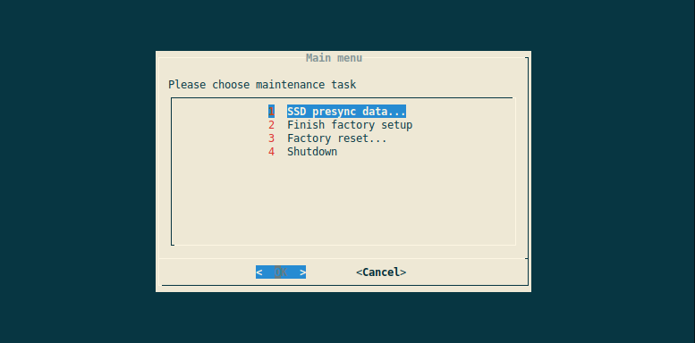

## Maintenance menu

Using the BitBoxApp as user interface requires the Middleware on the BitBoxBase to always be available.
Only then the node management dashboard is reachable the user can log in with the management password to be able to interact with the device.

In cases where this is not possible, e.g. because of a forgotten password or an internal error that prevents the Middleware to be reachable, the Maintenance Menu is available locally on a HDMI screen as a fallback.

### Features

The Maintenance Menu serves both the initial factory setup and a user-triggered factory reset.

#### Factory setup

The goal of the factory setup is to allow basic tasks like loading pre-synched Bitcoin blocks without knowing the device credentials.

Current features:

* Creating a Bitcoin / Electrs blocks snapshot to an external USB drive
* Loading snapshot from an external USB drive to the internal SSD
* Delete any files created during device testing (SSH / SSL certificats, application data, logs etc.)
* Wiping the factory credentials

#### Factory reset

The following options allow the user to reset the device in case of a forgotten management password or an internal configuration issue.

* **Authentication reset**: the BitBoxApp will allow to set a new management password on next connect
* **Configuration reset**: factory defaults are restored (Redis database, new SSH and SSL keys...), without touching any Bitcoin or Lightning data
* **Disk image reset**: in case an over-the-air update is no longer possible, an official, signed  BitBoxBase release image named `update.base` can be flashed from the USB flashdrive

It is also possible to flash a custom-built, unsigned firmware update using the "Disk image reset" functionality, but only if the BitBoxBase has been previously configured to accept unsigned updates (calling `bbb-config.sh enable unsigned_updates` from the command line).
This setting cannot be set from the Maintenance Menu.

### Authentication

Access to the Maintenance Menu is a sensitive operation and requires the possession of a "maintenance token".
This token is stored in `.maintenance-token` on the USB flashdrive, and updated with every system configuration backup.
It is a random number and acts as the authentication secret.
The BitBoxBase itself stores the SHA256 hashes of all previously created token in `/data/maintenance-token-hashes`.
Deleting this file revokes all previously issued maintenance token.

On every boot, the systemd [`startup-maintenance.service`](https://github.com/digitalbitbox/bitbox-base/blob/master/armbian/base/scripts/startup-maintenance.service) calls the script [`systemd-startup-maintenance.sh`](https://github.com/digitalbitbox/bitbox-base/blob/master/armbian/base/scripts/systemd-startup-maintenance.sh) which checks if a USB flashdrive containing a maintenance token is plugged into the BitBoxBase.
The token is validated by comparing its SHA256 hash against the local list of previoulsy created token hashes.
If a valid token is present, the Maintenance Menu is displayed on tty2 over HDMI.
Otherwise, the script exits immediately, without the possibility of any user interaction.

The inital BitBoxBase image flashed on new devices contains a "Shift factory token" that allows access to the menu with a maintenance token kept confidential by BitBoxBase personnel.
This factory token is [clearly marked as such](https://github.com/digitalbitbox/bitbox-base/blob/master/armbian/base/config/signatures/maintenance-token-hashes) and is removed either manually when running "Finish factory setup..." or when the first system configuration backup is created, usually at the end of the Setup Wizard.
