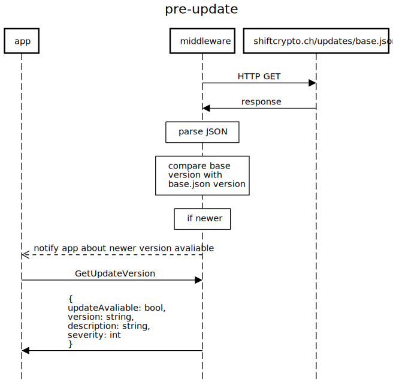

## Update notification

When the BitBoxApp is connected to the BitBoxBase, the version of the current Base image (and of Bitcoin-related services) is visible in the Node Management dashboard.

To check if a newer Base image is available, the Middleware checks [`shiftcrypto.ch/updates/base.json`](shiftcrypto.ch/updates/base.json) and compares it with the local semantic version. If a newer version is available, the App is notified and the user can trigger the system update.

