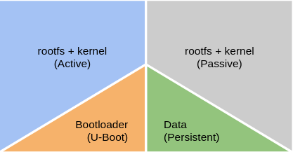
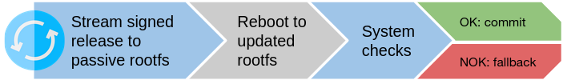

## Update process

After building the custom Armbian image, it is post-processed using [mender-convert](https://github.com/mendersoftware/mender-convert).
We collaborated with Mender to extend their solution to support the RockPro64 board, with all extension being released as open-source for other projects to use.

This post-processing creates Mender update artifacts for over-the-air (OTA) updates, as well as a new full disk image for initial flashing on the device, containing four partitions:

* bootloader
* root filesystem A
* root filesystem B
* persistent data

The disk image has the Mender client built in. It is executed on demand by the Middleware to update the device.

On the BitBoxBase, only one root filesystem - running the operating system and applications - is active at any given time, e.g. "root filesystem A".
When the update process is started, the new disk image is streamed directly to the non-active root filesystem, e.g. "root filesystem B".
After successful verification of the update signature and completion of the download, the bootloader is configured to boot from the updated "root filesystem B" once.
The device is then rebooted.

The BitBoxBase now boots into the updated "root filesystem B", where various custom checks can be performed.
If everything works as expected, the updated "root filesystem B" is commited to the bootloader as the new active partition.

If the device is unable to boot, or if application-level checks fail after the update, the system automatically falls back to booting to the previous "root filesystem A", which was working before the update.
This process makes it very unlikely that a device will end up in a state that can't be fixed using further OTA update.

See additional information on <https://mender.io/overview/solution>
